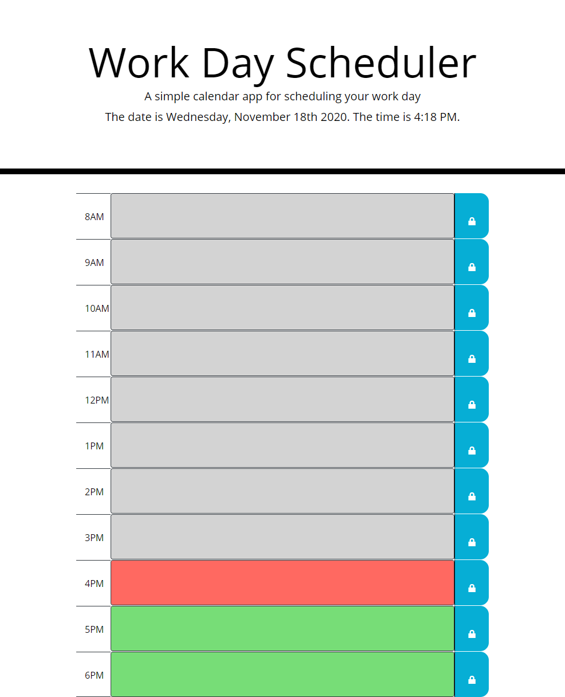

# Work Day Scheduler
### UCF Coding Boot Camp Week 5 Challenge.

## Purpose
Provides an application in which the user is able to load a scheduler to create and save hourly tasks during traditional business hours. This application also displays the current date and time at the moment of deployment. 

## Instructions
To utilize this application, the user must first deploy the website. 
1. User will then select the text area next to the hour they desire to create a task for. 
2. User will click the corresponding "Save Button" that is indicated by the blue button with a white lock icon at the end of the hour row. (Note: each hour row will have it's own save button).
3. To clear task, user will need to select and manually delete text desired. User will then need to click on the save button again to store updated changes. 

## Features
* Displays current date and time at the moment of the application deployment. 
* Tasks are added by clicking on text area next to corresponding hour. 
* Clicking the save button with store tasks in local storage. 
* Time-blocks are color coded to indicate if a task has past (grey), is current (red) or is in the future (green). 
* Tasks will persist on page after refreshing to ensure no progress is lost. 

## Deployed Production Link

[workday-scheduler](https://elysiayn.github.io/workday-scheduler/)

 

### Contributions
* Starter code provided by UCF Coding Boot Camp in inconjunction with Xander Rapstine. 
* Alterations to code in HTML, CSS and JS file made by Wendy Lemus. 
